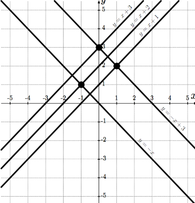

# Integer Points - 1000
**Tags**: Geometry, Maths  
- [Problem](#problem)
- [Solution](#solution)

## Problem
[Problem Link](https://codeforces.com/problemset/problem/1248/A)  

DLS and JLS are bored with a Math lesson. In order to entertain themselves, DLS took a sheet of paper and drew `n` distinct lines, given by equations `y = x + p_i` for some distinct `p_1, p_2, ..., p_n`.  

Then JLS drew on the same paper sheet `m` distinct lines given by equations `y = -x + q_i` for some distinct `q_1, q_2, ..., q_m`.  

DLS and JLS are interested in counting how many line pairs have `integer` intersection points, i.e. points with both coordinates that are integers. Unfortunately, the lesson will end up soon, so DLS and JLS are asking for your help.  
  
### Input
The first line contains one integer `t` (`1 <= t <= 1000`), the number of test cases in the input. Then follow the test case descriptions.  

The first line of a test case contains an integer `n` (`1 <= n <= 10^5`), the number of lines drawn by DLS.  

The second line of a test case contains `n` distinct integers `p_i` (`0 <= p_i <= 10^9`) describing the lines drawn by DLS. The integer `p_i` describes a line given by the equation `y = x + p_i`.  

The third line of a test case contains an integer `m` (`1 <= m <= 10^5`), the number of lines drawn by JLS.  

The fourth line of a test case contains `m` distinct integers `q_i` (`0 <= q_i <= 10^9`) describing the lines drawn by JLS. The integer `q_i` describes a line given by the equation `y = -x + q_i`.  

The sum of the values of `n` over all test cases in the input does not exceed `10^5`. Similarly, the sum of the values of `m` over all test cases in the input does not exceed `10^5`.  

`In hacks` it is allowed to use only one test case in the input, so `t=1` should be satisfied.  
  
### Output
For each test case in the input print a single integer — the number of line pairs with integer intersection points.

### Examples
```
Input
3
3
1 3 2
2
0 3
1
1
1
1
1
2
1
1
Output
3
1
0
```

### Note
The picture shows the lines from the first test case of the example. Black circles denote intersection points with integer coordinates.  



-----
## Solution

### Initial Thoughts
Well, DLS and JLS are never going to intersect. So we only need to consider the ones between.  
Current thoughts are just to do it all manually which has an efficiency of `O(n*m)` where `n` and `m` are the number of lines each person draws.  
This feels like it won't be efficient enough.  
[initial_thoughts.cpp](initial_thoughts.cpp)  

### Even-Odd Matching
Just count how many even and odds there are when looping through the p numbers.  
Start looping through the p numbers, if it's even, increment the even counter. If it's odd, increment the odd counter.  
Then start looping through the q numbers. If it's even, increment the answer by the even counter. Otherwise, increment it by the odd counter. Then return this final answer.  
This gives an O(n+m) time complexity.  
[even_odd_pairing.cpp](./even_odd_pairing.cpp)  

Solved!  
